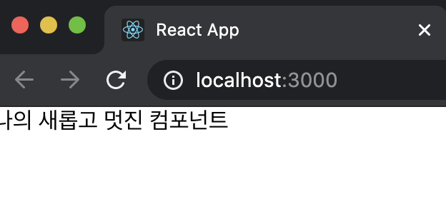
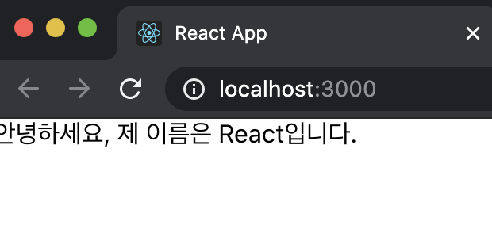
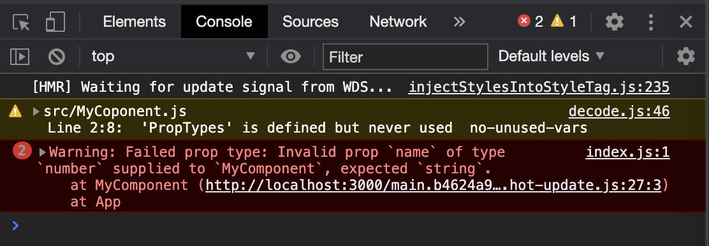
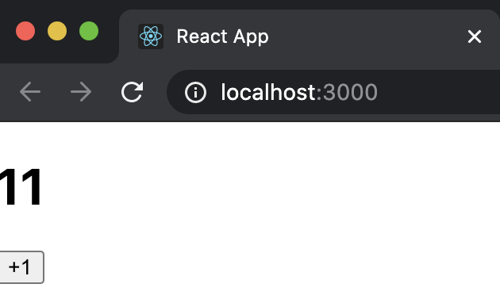
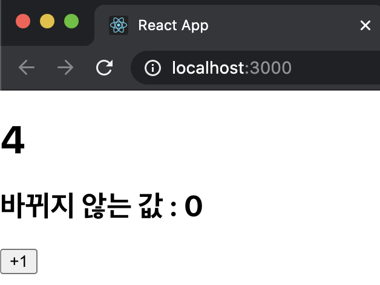
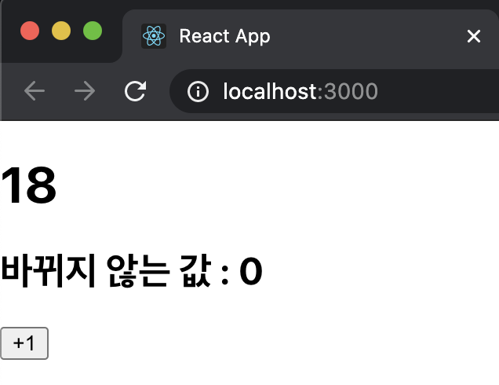
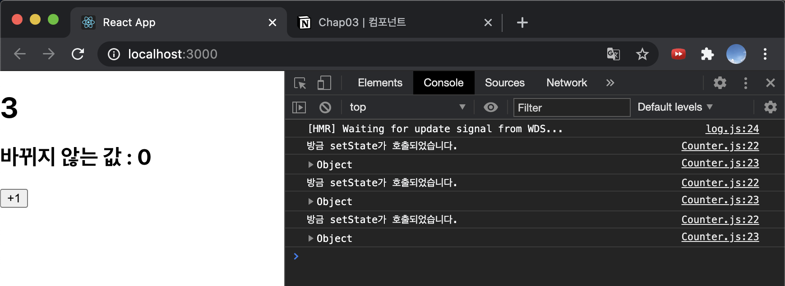
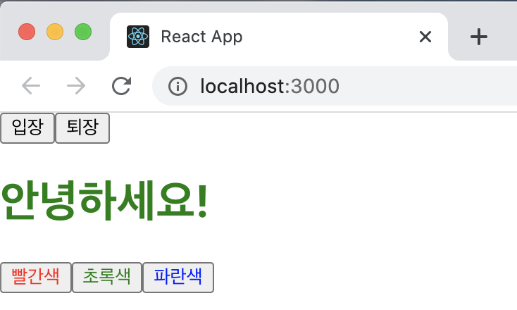

리액트를 사용해 애플리케이션의 인터페이스 설계시 → **사용자가 볼 수 있는 요소는 여러가지 컴포넌트**로 구성

### 컴포넌트의 기능
데이터 주어졌을 때 이에 맞게 UI를 만들고, 라이프사이클 API를 이요해 컴포넌트가 화면에서 나타날 때, 사라질 때, 변화가 일어날 때 주어진 작업들을 처리할 수 있으며, 임의 메서드를 만들어 특별한 기능 추가도 가능함 

(이 장에서 배울 것)
- 클래스형 컴포넌트
- 컴포넌트를 만들고 사용하는 방법
- 속성값 `props`
- 상태값 `state`

<br>

# 3.1 클래스형 컴포넌트

## 컴포넌트 선언 방식

### 1. 함수형 컴포넌트

```jsx
// 2장
import React from 'react'
import './App.css'

function App() {
  const name = "리액트"
  return <div className="react">{name}</div>;
}

export default App;
```

### 2. 클래스형 컴포넌트

```jsx
import React, {Component} from 'react'

class App extends Component {
  render() { // render() 함수가 반드시 존재!! - 그 내부에 보여주어야할 JSX 반환!
    const name = "리액트";
    return <div className="react">{name}</div>;
  }
}
  
export default App;
```

클래스형/함수형 컴포넌트의 **역할은 동일**!

<table>
  <tr>
    <td></td>
	  <td><b>함수형 컴포넌트</b></td>
	  <td><b>클래스형 컴포넌트</b></td>
  </tr>
  <tr>
    <td>장점</td>
	  <td>선언이 쉬움 <br>
	메모리 자원 절약 <br>
	결과물의 파일 크기가 더 작음 (큰 차이는 아님)</td>
    <td>state/라이프사이클API 사용 가능 <br>
	임의 메서드 정의 가능 <br>
	render 함수가 반드시 정의 (함수 내부에서 보여주어야 할 JSX 반환)</td>
  </tr>
  <tr>
    <td>단점</td>
    <td>state/라이프사이클API 사용 불가 → Hooks 기능 도입</td>
    <td>X</td>
  </tr>
</table>

<br>

# 3.2 첫 컴포넌트 생성

파일 만들기 → 코드 작성하기 → 모듈 내보내기 및 불러오기

## 1. 파일 만들기
src > MyComponent.js

## 2. 코드 작성하기
```jsx
import React from 'react';

const MyComponent = () => {
    return <div>나의 새롭고 멋진 컴포넌트</div>;
};

export default MyComponent;
```

#### Arrow Function in ES6

**`() => {}`** : 함수를 생성    
주로 함수 **파라미터를 전달**할 때 유용!!      
`function` 키워드를 완전 대체하지 못함! 용도가 다름!    

#### 함수형 컴포넌트 선언시

`function` 키워드 vs. 화살표 함수 문법    
→ 큰 차이는 없으나 **화살표 함수 문법이 좀 더 간결!**   


## 3. 모듈 내보내기 및 불러오기

### 1) `export` - 모듈 내보내기

(src > MyComponent.js)

```jsx
import React from 'react';

const MyComponent = () => {
    return <div>나의 새롭고 멋진 컴포넌트</div>;
};

export default MyComponent; // export : 다른 파일에서 이 파일을 import할 때, 이 클래스를 불러오도록 설정
```

### 2) `import` - 모듈 불러오기

(src > App.js)

```jsx
import React from 'react';
import MyComponent from './MyCoponent.js';

const App = () => {
  return <MyComponent />;
};
  
export default App;
```



<br>

# 3.3 `props` - 속성 설정

Properties의 약어

컴포넌트 **속성을 설정**할 때 사용하는 요소   
: props 값은 해당 컴포넌트를 불러와 사용하는 **부모 컴포넌트에서 설정 가능**

## 1. JSX 내부에서 props 렌더링

```jsx
import React from 'react';

const MyComponent = props => {
    return <div>안녕하세요, 제 이름은 {props.name}입니다.</div>;
};

export default MyComponent; 
```

: MyCoponent에서 name이라는 props를 렌더링하도록 설정

**JSX 내부에서 {}로 기호로 감싸준다!**

## 2. 컴포넌트를 사용할 때 props 값 지정하기

(src > App.js)

```jsx
import React from 'react';
import MyComponent from './MyCoponent.js';

const App = () => {
  return <MyComponent name="React"/>;
};
  
export default App;
```



## 3. props 기본 값 설정 : `defaultProps`

### `defaultProps`
props 값을 따로 지정하지 않았을 때 보여줄 기본값 설정

(src > MyCoponent.js)

```jsx
import React from 'react';

const MyComponent = props => {
    return <div>안녕하세요, 제 이름은 {props.name}입니다.</div>;
};

MyComponent.defaultProps = {
    name : '기본이름'
};

export default MyComponent;
```


## 4. 태그 사이의 내용을 보여주는 `children`

### `children`
컴포넌트 사용시 태그 사이의 내용을 보여주는 props

(src > App.js)

```jsx
import React from 'react';
import MyComponent from './MyCoponent.js';

const App = () => {
  return <MyComponent>리액트</MyComponent>;
};

export default App;
```

: MyComponent 태그 사이에 작성한 '리액트' 문자열을 MyComponent 내부에서 보여주려면 props.childen 값을 보여주어야 함

(src > MyComponent.js)

```jsx
import React from 'react';

const MyComponent = props => {
    return (
        <div>
            안녕하세요, 제 이름은 {props.name}입니다. <br/>
            children 값은 {props.children}
            입니다.
        </div>
    );
};

MyComponent.defaultProps = {
    name : '기본이름'
  };

export default MyComponent;
```


## 5. 비구조화 할당 문법을 통해 props 내부값 추출하기

자식 컴포넌트에서 props값 조회할 때마다 `props` 키워드를 붙여야 함   
비구조화 할당 문법을 사용해 **props의 내부 값 바로 추출** 가능

#### 비구조화 할당(Destructuring Assignment) in ES6
`const { name, children } = props;`    
함수의 파라미터 부분에서도 사용 가능
만약 함수의 파라미터가 객체라면 그 값을 바로 비구조화하여 사용함!!

(src > MyComponent.js)
```javascript
import React from 'react';

const MyComponent = props => {
    const {name, children} = props; // 
    return (
        <div>
            안녕하세요, 제 이름은 {name}입니다. <br/> //
            children 값은 {children} //
            입니다.
        </div>
    );
};

MyComponent.defaultProps = {
    name : '기본이름'
  };

export default MyComponent;
```
⇒ name, children 값을 더 짧은 코드로 사용 가능

(src > MyComponent.js)
```javascript
import React from 'react';

const MyComponent = ({name, children}) => { //
    return (
        <div>
            안녕하세요, 제 이름은 {name}입니다. <br/>
            children 값은 {children}
            입니다.
        </div>
    );
};

MyComponent.defaultProps = {
    name : '기본이름'
  };

export default MyComponent;
```
⇒ 훨씬 더 간단!!😎

함수형 컴포넌트에서 props를 사용시, **파라미터 부분에서 비구조화 할당 문법**을 사용

## 6. propTypes를 통한 props 검증 - `propTypes`

### `propTypes`
컴포넌트의 **필수 props**를 지정하거나 **props의 타입을 지정**할 때 사용   
지정 방법은 defaultProp와 유사    
propTypes를 사용하려면, import 구문 필요     

(src > MyComponent.js)

```javascript
import React from 'react';
import PropTypes from 'prop-types'; //

const MyComponent = ({name, children}) => {
    return (
        <div>
            안녕하세요, 제 이름은 {name}입니다. <br/>
            children 값은 {children}
            입니다.
        </div>
    );
};

MyComponent.defaultProps = {
    name : '기본이름'
};

MyComponent.propTypes = { // 
    name : PropTypes.string
};

export default MyComponent;
```
⇒ import 구문 필요   
⇒ name값은 반드시 string 형태    

🤔 props가 `propTypes`의 형태와 일치하지 않는다면?     
: 실행한 뒤 개발자 도구의 Console 탭을 연다면, 경고메세지 확인 가능! (타입 불일치)  



### 1) 필수 propTypes 설정 - `isRequired`

### `isRequired`

propTypes를 지정하지 않았을 때 오류메세지를 띄움

(src > MyComponent.js)

```javascript
import React from 'react';
import PropTypes from 'prop-types';

const MyComponent = ({name, favoriteNumber, children}) => { //
    return (
        <div>
            안녕하세요, 제 이름은 {name}입니다. <br/> 
            children 값은 {children}
            입니다.
            <br/>
            제가 좋아하는 숫자는 {favoriteNumber}입니다. //
        </div>
    );
};

MyComponent.defaultProps = {
    name : '기본이름'
};

MyComponent.propTypes = {
    name : PropTypes.string,
    favoriteNumber : PropTypes.number.isRequired //
};

export default MyComponent;
```


: 아직 favoriteNumber를 설정하지 않아서 다음과 같은 오류 메세지 발생

(MyComponent에게 FavoriteNumber 부여)

```javascript
import React from 'react';
import MyComponent from './MyCoponent.js';

const App = () => {
  return (
    <MyComponent name="React" favoriteNumber={1}> //
      리액트
    </MyComponent>
  );
};

export default App;
```

### 2) 더 많은 PropTypes 종류

교과서 p.101 참고      
자세한 정보 : [https://github.com/facebook/prop-types](https://github.com/facebook/prop-types) 참고

## 7. 클래스형 컴포넌트에서 props 사용하기

render 함수에서 **`this.props`를 조회**하면 된다!

defualtProps & propsTypes은 동일한 방식으로 설정~

(src > MyComponent.js)

```javascript
import React, { Component } from 'react';
import PropTypes from 'prop-types';

class MyComponent extends Component {
    render() {
        const {name, favoriteNumber, children} = this.props; // 비구조화 할당
        return (
            <div>
                안녕하세요, 제 이름은 {name}입니다. <br/> 
                children 값은 {children}
                입니다.
                <br/>
                제가 좋아하는 숫자는 {favoriteNumber}입니다.
            </div>
        );
    }
}

MyComponent.defaultProps = {
    name : '기본이름'
};

MyComponent.propTypes = {
    name : PropTypes.string,
    favoriteNumber : PropTypes.number.isRequired
};

export default MyComponent;
```

클래스형 컴포넌트의 **class 내부**에서 **defualtProps와 propTypes를 설정**하는 법도 존재함!

(src > MyComponent.js)

```javascript
import React, { Component } from 'react';
import PropTypes from 'prop-types';

class MyComponent extends Component {
    static defaultProps = {
        name : '기본이름'
    };

    static propTypes = {
        name : PropTypes.string,
        favoriteNumber : PropTypes.number.isRequired
    };
    
    render() {
        const {name, favoriteNumber, children} = this.props; // 비구조화 할당
        return (
            <div>
                안녕하세요, 제 이름은 {name}입니다. <br/> 
                children 값은 {children}
                입니다.
                <br/>
                제가 좋아하는 숫자는 {favoriteNumber}입니다.
            </div>
        );
    }
}

export default MyComponent;
```

(노트) `defualtProps`와 `propTypes`는 꼭 사용해야 하는가?      
컴포넌트 필수사항은 아니지만, 큰 프로젝트에서 해당 컴포넌트에 어떤 props가 필요한지 쉽게 알 수 있어 개발 능률이 좋아짐!

<br>

# 3.4 `state` - "상태 값"

### `state`
컴포넌트 **내부에서 바뀔 수 있는 값**

### **vs. `props`**
컴포넌트 사용 과정에서 **부모 컴포넌트가 설정**하는 값      

> 자식 컴포넌트는 해당 props를 읽기 전용으로만 사용 가능      
> → 부모 컴포넌트에서 변경해야 props가 바뀜     


## 1. 클래스형 컴포넌트의 `state`

(src > Counter.js)
```javascript
import React, {Component} from 'react';

class Counter extends Component {
    // 생성자
    constructor(props) {
        super(props); // 반드시 호출 : 현재 클래스형 컴포넌트가 상속받고 있는 리액트의 Component 클래스가 지닌 생성자 함수를 호출
        // state의 초기값 설정
        this.state = {
            number : 0
        };
    }
    
    render() {
        const {number} = this.state; // state를 조회할 때는 this.state로 조회
        return (
            <div>
                <h1>{number}</h1>
                <button
                    // onClick을 통해 버튼이 클릭되었을 때 호출할 함수를 지정
                    onClick={()=>{
                        // this.setState를 사용하여 state에 새로운 값을 넣을 수 있음
                        this.setState({number: number + 1}) // 값 변경 함수
                    }}
                > // 이벤트 설정 : 화살표 함수 문법
                    +1    
                </button> 
            </div>
        );
    }
}

export default Counter;
```

(src > App.js)
```javascript
import React from 'react';
import Counter from './Counter.js';

const App = () => {
  return (
    <Counter />
  );
};

export default App;
```



### 1) state 객체 안에 여러 값이 있을 때

(src > Counter.js) : 현재 state 안에 fixedNumber 라는 값을 추가
→ 버튼 클릭시 number의 값만 증가하고, fixedNumber의 값은 유지

```javascript
import React, {Component} from 'react';

class Counter extends Component {
    // 생성자
    constructor(props) {
        super(props); 
        // state의 초기값 설정
        this.state = {
            number : 0,
            fixedNumber : 0
        };
    }
    
    render() {
        const {number, fixedNumber} = this.state; // state를 조회할 때는 this.state로 조회
        return (
            <div>
                <h1>{number}</h1>
                <h2>바뀌지 않는 값 : {fixedNumber}</h2>
                <button
                    // onClick을 통해 버튼이 클릭되었을 때 호출할 함수를 지정
                    onClick={()=>{
                        // this.setState를 사용하여 state에 새로운 값을 넣을 수 있음
                        this.setState({number: number + 1})
                    }}
                >
                    +1    
                </button>
            </div>
        );
    }
}

export default Counter;
```

: `this.setState` 함수는 인자로 전달된 객체 안에 들어있는 값만 바꾸어 주기에 인자로 fixedNumber를 넣지는 않음!

### 2) state를 constructor에서 꺼내기 
state의 초기값 지정을 위해 constructor 메서드를 선언함!

(또 다른 방식) - state 초기값 지정 
**: constructor 메서드 (생성자)를 선언하지 않고도** state 초기값 설정도 가능

```jsx
import React, {Component} from 'react';

class Counter extends Component {
    state = {
        number : 0,
        fixedNumber : 0
    };

    render() {
       (...)
    }
}

export default Counter;
```

### 3) `this.setState`에 객체 대신 함수 인자 전달하기

**: this.setState를 사용해 state 값을 업데이트** 할 때 → 비동기적으로 업데이트!

(src > Counter.js - button onClick)

```jsx
onClick={()=>{
    // this.setState를 사용하여 state에 새로운 값을 넣을 수 있음
    this.setState({number: number + 1})
    this.setState({number: this.state.number + 1})
}}
```

⁉️ this.setState 2번 호출 → but, 숫자는 1씩 더해짐?!
⇒ this.setState를 사용한다고 해서 state 값이 바로 바뀌는 것은 아님~
(Solution) this.setState를 사용할 때, 객체 대신에 **함수를 인자**로 넣어주는 것!

### **(형식) - this.setState의 인자로 함수를 넣어줄 때 코드**

```jsx
this.setState((prevState, props) => {
	return {
		// 업데이트 내용
	}
})
```
- prevState : 기존 상태
- props : 현재 지니고 있는 props → 필요 없으면, 생략가능!

(src > Counter.js - button onClick)
```jsx
onClick={()=>{
    // this.setState를 사용하여 state에 새로운 값을 넣을 수 있음
		// **case1)**
    this.setState(prevState => {
        return {
            number: prevState.number + 1
        }
    });

    // 동일한 코드 
		// **case2)** 함수에서 바로 객체를 반환~
		// prevState => ({  }) 형식의 코드!
    this.setState(prevState=> ({
        number: prevState.number +1
    }))
}}
```

: 숫자가 2씩 증가함

📌  화살표 함수에서 값을 바로 반환?
: 코드 블록 { }를 생략! (위 예시의 case2 참고)

```jsx
const sum = (a, b) => a+b;
```

### 4) `this.setState`가 끝난 후 특정 작업 실행하기
: setState를 사용해 값 업데이트 한 후 특정 작업을 하고 싶을 때는 **setState의 두번째 파라미터**로 **콜백(callback) 함수를 등록**해 작업을 처리

(src > Counter.js - button onClick)
```jsx
<button
    // onClick을 통해 버튼이 클릭되었을 때 호출할 함수를 지정
    onClick={()=>{
        this.setState (
            {
                number: number + 1
            },
            () => {
                console.log('방금 setState가 호출되었습니다.');
                console.log(this.state);
            }
        );
    }}
>
    +1    
</button>
```
: 콜백함수 등록 후 브라우저를 열어 개발자 도구의 Console 탭을 확인!



## 2. 함수형 컴포넌트에서 `useState` 사용하기

`useState`함수로 state 사용 가능!  
(Hooks의 종류 중 하나)

### 1) 배열 비구조화 할당

배열 내부 값을 쉽게 추출

```jsx
const array=[1,2];
const one=array[0];
const two=array[1];

// 비열 비구조화 할당 -> 훨.씬.깔.끔!
const array=[1,2];
const [one, two] = array; 
// [one, two] = [1, 2];
```

### 2) `useState` 사용하기

(src > Say.js)
```jsx
import React, {useState} from 'react';

const Say = () => {
    const [message, setMessage] = useState('');
    const onClickEnter = () => setMessage('안녕하세요!');
    const onClickLeave = () => setMessage('안녕히 가세요!');

    return (
        <div>
            <button onClick={onClickEnter}>입장</button>
            <button onClick={onClickLeave}>퇴장</button>
            <h1>{message}</h1> 
        </div>
    );
};

export default Say;
```
- 클래스형 컴포넌트의 state 초기값 : 객체의 형태
- useState 함수 : 객체가 아니어도 가능
`const [현재상태, 상태변경함수] = useState(초기값);`
**message : 현재 상태**
**setMessage : 상태를 바꾸는 함수** → setter 함수

(src > App.js)
```jsx
import React from 'react';
import Say from './Say.js';

const App = () => {
  return (
    <Say />
  );
};

export default App;
```


### 3) 한 컴포넌트에서 useState 여러 번 사용하기

useState는 한 컴포넌트에서 여러번 사용도 된다!

(src  > Say.js)

```jsx
import React, {useState} from 'react';

const Say = () => {
    const [message, setMessage] = useState('');
    const onClickEnter = () => setMessage('안녕하세요!');
    const onClickLeave = () => setMessage('안녕히 가세요!');

    const [color, setColor] = useState('black');

    return (
        <div>
            <button onClick={onClickEnter}>입장</button>
            <button onClick={onClickLeave}>퇴장</button>
            <h1 style={{ color }}>{message}</h1> 

            <button style={{ color: 'red' }} onClick={() => setColor('red')}>빨간색</button>
            <button style={{ color: 'green' }} onClick={() => setColor('green')}>초록색</button>
            <button style={{ color: 'blue' }} onClick={() => setColor('blue')}>파란색</button>

        </div>
    );
};

export default Say;
```



<br> 

# 3.5 state를 사용할 때 주의사항

(클래스형/함수형 컴포넌트 모두 해당)
**`state 값을 바꾸어야 할 때`는 setState 혹은 useState를 통해 전달받은 `setter 함수`를 사용해야 함!**

배열/객체 업데이트시, 어떻게?
배열/객체 사본을 만들고 그 사본에 값을 업데이트 → 그 사본의 상태를 setState 혹은 setter함수를 통해 업데이트

```jsx
// 객체 다루기
const object = {a:1, b:2, c:3};
const nextObject = {...object, b:2};

// 배열 다루기
const array = [
    {id:1, value:true},    
    {id:2, value:true},
    {id:3, value:false},
];
let nextArray = array.concat({id:4}); // 새항목 추가
nextArray.filter(item => item.id !== 2) // id가 2인 항목 제거
nextArray.map(item => (item.id === 1 ? {...item, vlae :false}:item)); // id가 1인 항목의 value를 false로 설정
```

⇒ **객체에 대한 사본**을 만들 때, **spread 연산자라 불리는 `...`**을 사용해 처리

⇒ **배열에 대한 사본**을 만들 때, **배열의 내장 함수**로 처리

<br>

# 3.6 정리

1. 컴포넌트를 생성하고, 불러오기/내보내기
2. `props` 사용법 "속성 설정"
3. `state` 사용법 "상태 값"

### `props` vs. `state`
<table>
  <tr>
    <td></td>
    <td>props</td>
    <td>state</td>
  </tr>
  <tr>
    <td>공통점</td>	
    <td colspan="2">컴포넌트에서 사용 <br>
	  렌더링할 데이터를 담고 있음</td>
  </tr>
  <tr>
    <td>차이점</td>
    <td>부모 컴포넌트가 설정 (유동적인 props사용은 가능은 함) <br></td>
    <td>컴포넌트 자체적으로 지닌 값 → 컴포넌트 내부에서 값 없데이트 가능!</td>
  </tr>
</table>


### `state` 다루는 방법
- 클래스형 컴포넌트: `state`
- 함수형 컴포넌트:  **`useState`**  -> 권장!
